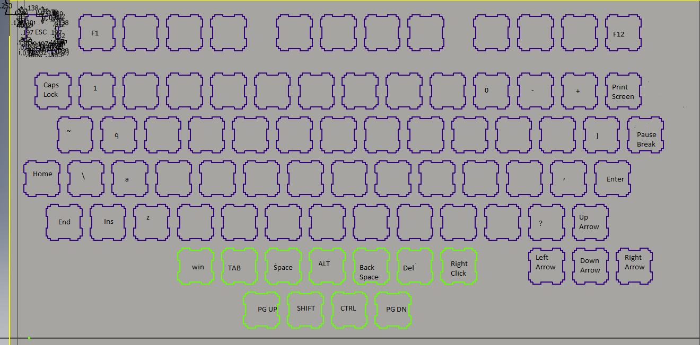
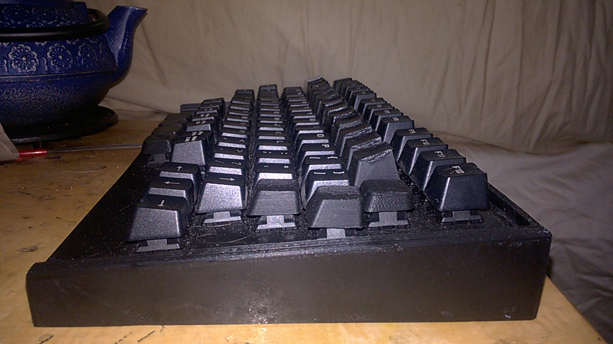

# Layout
## Mostly Standard
I'm not interested anything drastic like dvorak. The main section of the keybaord was to remain mostly intact. The section with the arrows keys and over would be lopped off and consolidated with the main keyboard.
## The Spacebar
As the main driver was to add more buttons for the thumb the spacebar would only be one [unit](https://deskthority.net/wiki/Unit). In it's place from left to right would be the windows key, tab, spacebar, alt, backspace, delete, and context menu. This row was going to be aligened with the one above it.
## Another Row
It seemed reasonable to add another row below the space bar. This is a four button row offset half a unit from the spacebar row. From left to right it would have page up, shift, control, page down.
## Arrow Keys
I like using the arrow key for some things. I moved that left under the enter key.
## Other Modifications
Since some of the keys haved moved under the thumb. I filled in some missing keys around. Tilde got moved to where Tab was, caps lock moved to where tilde was, backslash got moved to where caps lock was, insert home and end went on the left side filling out where shift and part of caps lock were. Last I put print sreen where backspace was and Pause/Break where backslash was. Believe it or not I use Pause/Break.

# Key Caps
## Parametric Key Caps and Unconventional Key Locations
I primarily use a 'DAS Keyboard' which has parametric keycaps. I though I'd play with this a bit since I put some keys in unconventional locations. My new row has a very short key cap new row to make it easier to avoid fat finger it. I'd also make caps lock and print screen shorter than the keys around them for the same reason. The spacebar row also got keys angled for the number row, since I didn't want my fingers to hit them as easily.

