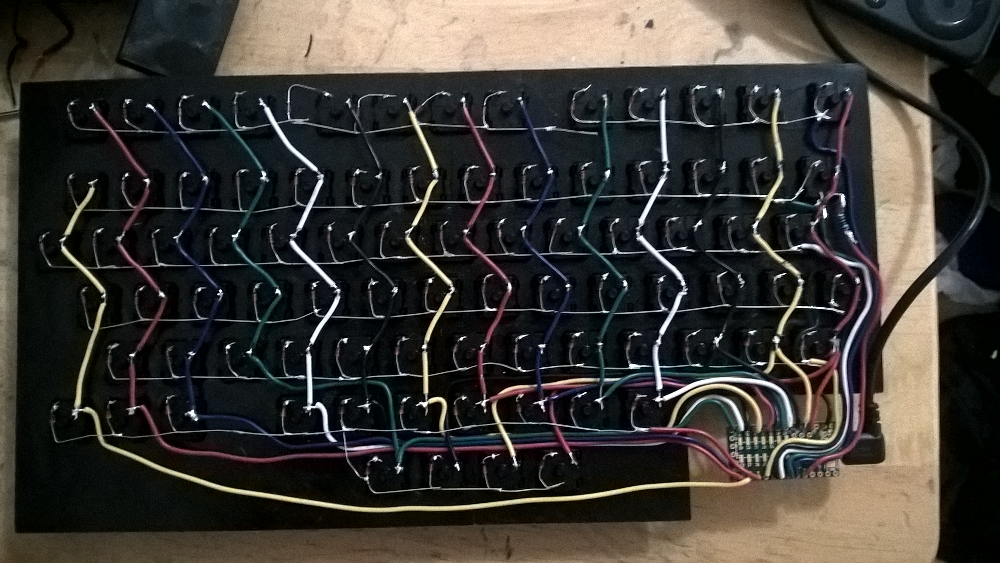

# Wiring
I'm not going to go very indepth with this step. I've included the reference I used to learn this. They are very good and I don't see the point in duplicating that info. 
The bottom to rows were wired as a single row since they are 13 keys in total.

## Tips
* I used my diodes to wire the rows, wires for the columns. It doesn't matter, it just made it easier.
* Make sure all of your diodes go in the same direction.
* I found it easier to run the diodes/wires the lenght of the row/column and cut it, then soder a wire from a convenient location on the row/column and run the cable to the controller.

